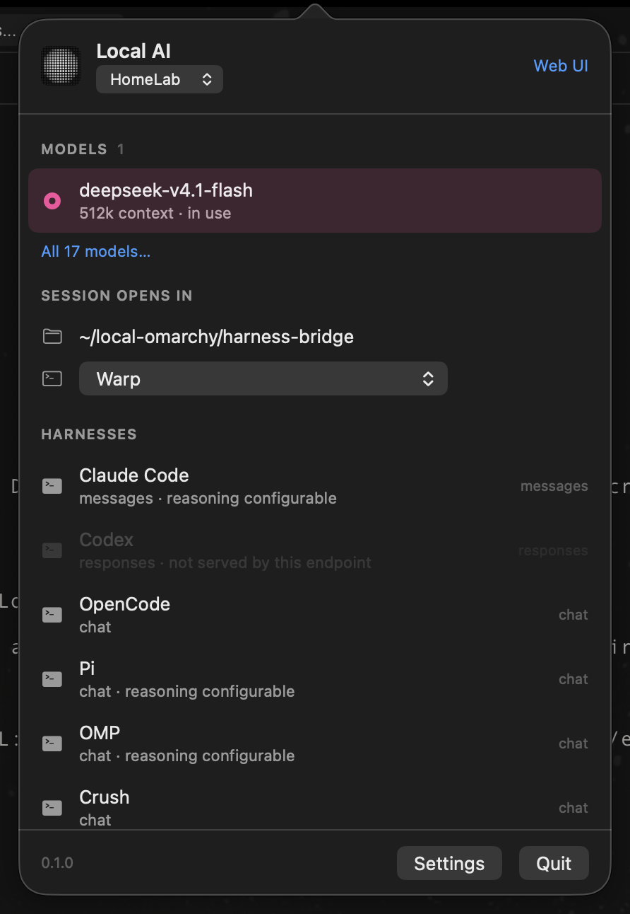
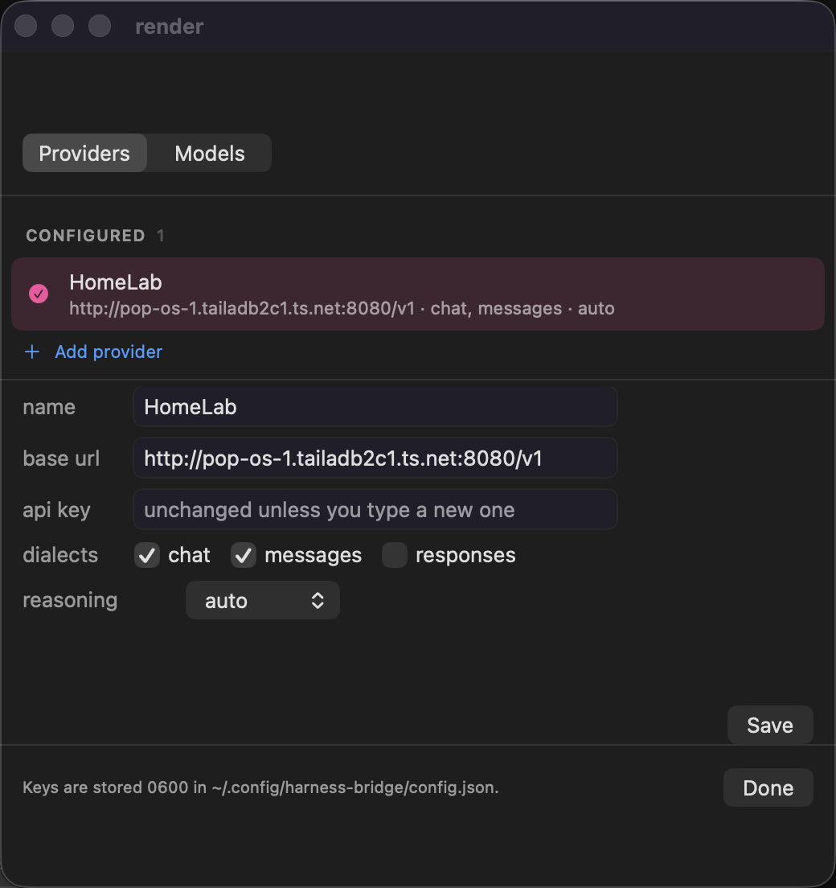

# Local AI

Point any coding harness — Claude Code, Codex, OpenCode, Pi, OMP, Crush, Copilot, Grok —
at any OpenAI-, Anthropic- or Responses-compatible inference endpoint. Pick a model from
what the endpoint actually serves, click a harness, and it opens already talking to that
model.

<p align="center"></p>

Nothing you own is edited. Your `~/.claude.json`, `~/.codex/config.toml` and
`~/.config/opencode` are untouched: the endpoint, key and model travel in the launch
environment, and the only setting the tool persists is its own selection.

Four packages, one core:

| Package | What it is |
|---|---|
| [`packages/core`](packages/core/src) | providers, model discovery, launch plans, sessions |
| [`packages/cli`](packages/cli/src) | the `harness-bridge` / `hbr` executables |
| [`packages/tray`](packages/tray) | **Local AI** — the macOS menu bar app |
| [`packages/web`](packages/web/src) | a browser UI on `127.0.0.1` |

Everything else is a thin shell over the core; each shell issues the same commands you
would type.

## Quick start

Requires [Bun](https://bun.sh) ≥ 1.1; the menu bar app needs macOS with Xcode command
line tools.

```sh
git clone https://github.com/0xSero/harness-bridge && cd harness-bridge
bun install
cd packages/cli && bun link      # puts `harness-bridge` and `hbr` on your PATH
```

```sh
# 1. name an endpoint
harness-bridge providers add --name HomeLab --url http://host:8080/v1 --key sk-…

# 2. see what it actually serves, and pick
harness-bridge models
harness-bridge use deepseek-v4.1-flash

# 3. open a harness on it
harness-bridge run claude
```

The key is written to `~/.config/harness-bridge/config.json`, mode `0600`. It is never
passed on a command line, never logged, and never committed. A session never contains it
either — see [Sessions](#sessions).

### macOS menu bar

`bash packages/tray/build.sh` builds `Local AI.app` and a `Local AI.dmg`; install from the
DMG, or:

```sh
open -a "/Applications/Local AI.app"
```

<p align="center"></p>

The panel shows the model in use, everything pinned beside it, the folder and terminal a
session opens in, and every installed harness. Settings holds the providers — select one
to edit it; the key is never displayed and a blank field keeps the stored one — and the
full model catalogue, with pin toggles.

## Sessions are a command

A session is not a generated script. It is one command you can read:

```
harness-bridge run --harness omp --exec --dir /Users/you/project
```

The terminal is handed exactly that. It re-enters the CLI, which builds the launch
environment at run time from the `0600` config — so **no key is ever written to a file**,
and a session always reflects your current selection rather than one frozen when a
command was composed. Delete `~/.config/harness-bridge/` and the tool leaves no trace.

### Choosing the terminal

```sh
harness-bridge terminal                 # what is installed, and what is in use
harness-bridge terminal ghostty         # warp, terminal, iterm, kitty, wezterm, …
harness-bridge terminal custom --command 'open -a WezTerm {dir}'
```

`auto`, the default, follows `$TERM_PROGRAM`: launch from Warp and it opens in Warp;
from Ghostty, in Ghostty. Each terminal has its own mechanism — Ghostty, kitty, Alacritty
and WezTerm take the command as argv; Terminal.app and iTerm are driven by AppleScript;
Warp has no `-e`, so it is driven by a [Tab Config](https://docs.warp.dev/terminal/windows/tab-configs/)
(`warp://tab_config/<name>`), which opens a **tab in the window that already has focus**
and only opens a window when none is open. That file is the only thing this tool writes
into another app's directory.

`{command}`, `{dir}` and `{name}` substitute into a custom template.

### Choosing the folder

```sh
harness-bridge dir ~/code          # remembered for every later session
harness-bridge run --dir /tmp omp  # or just this one
```

With no `dir` set, a session opens wherever the shell started. The panel has a folder
picker and the web UI a text field for the same setting.

## Harness flags

Claude Code and Codex skip their own confirmation prompts by default —
`--dangerously-skip-permissions` and `--dangerously-bypass-approvals-and-sandbox`. That is
convenient against a local endpoint and worth knowing about, so it is not hidden:

```sh
harness-bridge args claude                 # what it launches with
harness-bridge args claude -- --permission-mode acceptEdits
harness-bridge args claude --default       # back to the built-in flags
harness-bridge run --safe claude           # omit them for this one launch
```

## Dialects

A harness is only offered when the endpoint speaks its dialect. That is a correctness rule,
not a preference: Responses-shaped traffic to a Chat endpoint fails on the first turn.

| Harness | Dialect | How it reaches the endpoint |
|---|---|---|
| `claude` | `messages` | `ANTHROPIC_BASE_URL`, `ANTHROPIC_AUTH_TOKEN`, `ANTHROPIC_MODEL`, `--model` |
| `codex` | `responses` | `-c model_providers.local.*`, `-c model_provider=local`, `LOCAL_AI_KEY` |
| `opencode` | `chat` | inline `OPENCODE_CONFIG_CONTENT` provider, key via `{env:…}` |
| `pi`, `omp` | `chat` | a config the harness reads through its own environment variable |
| `crush` | `chat` | plugin-owned `XDG_CONFIG_HOME` |
| `copilot` | `chat` | `COPILOT_PROVIDER_BASE_URL`, `COPILOT_PROVIDER_API_KEY` |
| `grok` | `chat` | plugin-owned `GROK_HOME/config.toml` |
| `aider`, `hermes`, and anything else | `chat` | `OPENAI_BASE_URL`, `OPENAI_API_BASE`, `OPENAI_MODEL` |

The context window a harness is told about is the model's real one, read from the
endpoint's `/models`, so nothing silently assumes 128k. Claude Code does not know locally
served model names, so the bridge also sets `CLAUDE_CODE_MAX_CONTEXT_TOKENS` and
`CLAUDE_CODE_DISABLE_UNKNOWN_MODEL_WINDOW_ENFORCEMENT` — it then uses the real window
instead of warning and compacting early.

## Reasoning

`auto` by default: nothing is sent, and the harness and engine keep their own settings.

```sh
harness-bridge providers reasoning high
```

| Harness | How the level is passed |
|---|---|
| Claude Code | `MAX_THINKING_TOKENS` (4096 / 16384 / 32768) |
| Codex | `-c model_reasoning_effort=<low\|medium\|high>`, and `minimal` for `off` |
| Pi, OMP | the `supportsReasoningParams` compat flag is lifted, so params are sent |
| others | no reasoning knob; the setting is ignored |

## Missing harnesses install themselves

```sh
harness-bridge run --harness crush     # not installed -> installed, then launched
harness-bridge install crush           # or on its own
```

Installs use the vendor's own package (`npm`, `bun` or `pipx`). Harnesses that ship as
downloaded binaries — OMP, Grok, Hermes — are not guessed at: the tool prints the vendor's
install hint instead. `--no-install` refuses to install anything.

## Command reference

```
providers                              list configured providers
providers add --name N --url U --key K [--apis chat,messages] [--reasoning L]
providers rm <id> | use <id> | reasoning <level> [provider] | show <id> [--json]
models [provider] [--fresh]            live models from the endpoint
use <model> [provider]                 select a model
harnesses [provider]                   installed, and what the endpoint can drive
install <harness>                      install one
run [model] [harness]                  open a session
     --print  --exec  --no-install  --safe  --provider <id>  --dir <path>  -- <flags…>
pin <model> | unpin <model> | pins     what the panel shows
dir [path]                             where sessions open
terminal [id|auto|custom]              which terminal sessions open in
args <harness> [-- flags | --default]  the flags a harness launches with
snapshot [--json] | status | config    the whole state, a summary, or the file path
```

`models` and `snapshot` cache the model list on disk for 30 seconds, so a UI opens
instantly instead of waiting on the endpoint; `--fresh` refetches now. When the endpoint
fails, the last list is served rather than an empty one — a momentary blip should not
blank the panel.

## Web UI

```sh
bun packages/web/src/server.ts     # http://127.0.0.1:4141
```

Providers, the model catalogue, and launching — the same commands as the CLI, in a
browser. Bound to loopback with no authentication: it is for your machine, or for a
tailnet you trust.

## Layout

```
packages/core/src/core.ts        providers, sessions, launch plans
packages/core/src/harnesses.ts   what each harness is, how it installs, its default flags
packages/core/src/terminals.ts   how a session is opened in each terminal
packages/core/src/models.ts      the model list and its disk cache
packages/core/src/snapshot.ts    the read model every UI renders
packages/cli/src/cli.ts          command wiring
packages/tray/*.swift            the menu bar app
packages/web/src/server.ts       Bun.serve and the single page
```

## Testing

```sh
bun test
```

Unit tests cover dialect gating, the argv and environment built for each harness, secret
handling and config round-tripping. `test/cli.test.ts` runs every verb in a throwaway
config home — the test that catches the bugs refactors actually introduce.

End to end, a real completion was returned through the generated launch environment on:

| Machine | Architecture | What ran |
|---|---|---|
| macOS | arm64 | Claude Code (`messages`), OMP (`chat`), Warp and Terminal.app launches |
| Pop!_OS 22.04 | x86_64 | Claude Code, OMP |
| DGX Spark, Ubuntu 24.04 | aarch64 | OMP; and Claude Code from a clean machine, installed by `run` before launching |

Headless hosts are fine for everything except opening a window: `terminal` and `snapshot`
work, and a launch reports the missing emulator instead of failing silently.

## Licence

MIT
